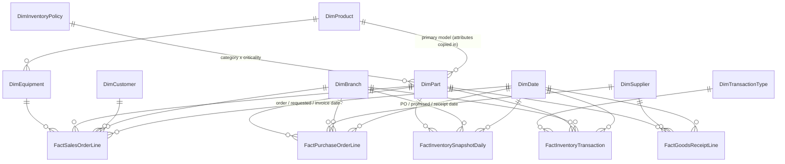
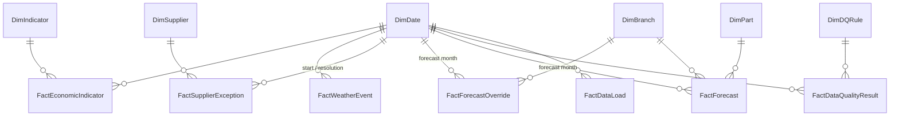

# Data Model Design

## Purpose

This document defines how source data is organized in the database so that every KPI in the [KPI Catalog](../01_Business_Foundation/1.4%20KPI_Catalog.md) can be calculated consistently, from one place, by Power BI, the forecasting engine, and the AI agents.

The model follows a **star schema** (Kimball dimensional modeling): facts hold measurable business events, dimensions describe them. This is the structure Power BI is built for: simple relationships, fast filtering, and DAX measures that behave predictably.

**Platform:** SQL Server 2025 (local, Developer Edition). All scripts use T-SQL that also runs on Azure SQL Database, so the same model can be deployed to the cloud without changes.

---

# Database Layers

Data moves through five schemas. Each one has a single job.

```text
 Source files / APIs
        │
        ▼
 ┌─────────────┐   Exactly as received. Every column is text. Nothing is fixed or removed.
 │  raw        │   Adds load metadata (file, load time, row number).
 └─────────────┘
        │  data quality rules run here
        ▼
 ┌─────────────┐   Typed, standardized, de-duplicated. Part numbers, supplier names,
 │  clean      │   dates, and units are normalized. Records failing a High severity
 └─────────────┘   rule are quarantined, not loaded.
        │
        ▼
 ┌─────────────┐   Star schema: dimensions and facts. What Power BI, the forecasting
 │  mart       │   engine, and the AI agents read.
 └─────────────┘

 ┌─────────────┐   Rule definitions, rule results per load, quarantined records,
 │  dq         │   and the issue register used by the Data Quality Agent.
 └─────────────┘

 ┌─────────────┐   Load log: what was loaded, when, how many rows, success or failure.
 │  audit      │   Feeds data freshness (DQ-03).
 └─────────────┘
```

**Why keep `raw` untouched?** If a cleansing rule turns out to be wrong, the data can be rebuilt from `raw` without going back to the source. It is also the evidence trail: every number in Power BI can be traced back to the record that produced it.

---

# Modeling Conventions

| Convention | Rule |
|---|---|
| **Table names** | `Dim<Name>` and `Fact<Name>` in the `mart` schema |
| **Column names** | `snake_case`, matching source field names where possible |
| **Surrogate keys** | Every dimension has an integer `<name>_key` (identity). Facts join on surrogate keys, never on business IDs |
| **Business keys** | Source IDs (`branch_id`, `part_id`, ...) are kept on the dimension for traceability and are unique |
| **Unknown member** | Every dimension has a row with key `-1` ("Unknown"). Used when an optional reference is blank (for example, a sales line with no equipment serial) |
| **Date keys** | `INT` in `YYYYMMDD` format, referencing `DimDate` |
| **Role-playing dates** | A fact with several dates (order, requested, invoice) has one key per role, all pointing to `DimDate`. In Power BI one relationship is active; the others are used with `USERELATIONSHIP` |
| **Slowly changing dimensions** | Type 1 (overwrite) by default. `DimSupplier` is Type 2 (history kept) because lead time and tier changes must be evaluated as they were at the time of each PO |
| **Measures** | Facts store additive quantities and amounts. Ratios (fill rate, on-time %) are **never** stored. They are DAX measures, so they aggregate correctly at any level |
| **Row-level flags** | Facts may store per-row flags (`is_on_time`, `is_filled_from_stock`) that make DAX simpler. These are facts about one row, not ratios |
| **Indexes** | Large facts use a clustered columnstore index (compressed, fast for analytics) |
| **Relationships** | Foreign keys are declared so Power BI detects relationships automatically on import |

---

# Dimensions

| Dimension | Grain | Source | Key attributes | Type |
|---|---|---|---|---|
| **DimDate** | One row per calendar day, 2018 – 2027 | Generated | Day, week, month, quarter, year, weekday flag, US holiday flag, season, construction-season flag | Static |
| **DimBranch** | One row per branch | `branch_master` | Branch name, region, state, branch type, open date, active flag | SCD 1 |
| **DimProduct** | One row per equipment model (CAT 320, D6...) | `product_master` + category + family | Model, category, family, business segment, criticality, lifecycle | SCD 1 |
| **DimPart** | One row per part number | `part_master` + `critical_parts` + product hierarchy | Part number, description, category, criticality, unit cost, UOM, primary supplier, primary model, family, critical-part flag and priority | SCD 1 |
| **DimSupplier** | One row per supplier **version** | `supplier_master` | Name, tier, type, location, master lead time, payment terms, `valid_from` / `valid_to` / `is_current` | **SCD 2** |
| **DimCustomer** | One row per customer | `sales_orders` (distinct customers) | Customer name (standardized) | SCD 1 |
| **DimEquipment** | One row per serialized machine | `equipment_master` | Serial, model, model year, service meter hours, home branch, ownership | SCD 1 |
| **DimTransactionType** | One row per inventory transaction type | Generated | Category (Issue, Receipt, Transfer, Adjustment, Return, Opening), direction, counts-as-COGS flag | Static |
| **DimInventoryPolicy** | One row per part category × criticality | `Inventory_Policy_Matrix` | Service level target, review cycle, min / max days of supply | SCD 1 |
| **DimIndicator** | One row per external series | FRED, EIA | Series ID, name, category, geography, frequency, units, source | SCD 1 |
| **DimDQRule** | One row per data quality rule | Defined in Phase 3 | Rule name, dimension, severity, table, column | SCD 1 |

---

# Facts

## Core operational facts

| Fact | Grain | Type | Approx. rows | Main KPIs |
|---|---|---|---|---|
| **FactSalesOrderLine** | One row per sales order line | Transaction | 86K | SVC-01 to 05, SVC-04, FIN-01, FIN-02 |
| **FactPurchaseOrderLine** | One row per PO line | Accumulating snapshot | 68K | SUP-01, 02, 03, 05, 06, NET-01 |
| **FactGoodsReceiptLine** | One row per goods receipt line | Transaction | 71K | SUP-04 |
| **FactInventoryTransaction** | One row per stock movement | Transaction | 177K | INV-02 (cost of goods), INV-07, NET-01 |
| **FactInventorySnapshotDaily** | One row per branch × part × day | Periodic snapshot | ~7.5M | SVC-06, INV-01, 03, 04, 05, 06, NET-02, FIN-03 |

**FactSalesOrderLine combines sales orders and demand transactions.** Both sources describe the same event at the same grain (one order line), so they form one fact: what was ordered, at what price, and how it was fulfilled (from stock, backordered, or lost). Keeping them in one table avoids a one-to-one join in Power BI.

**FactPurchaseOrderLine is an accumulating snapshot.** Each PO line is one row that is updated as it moves through its life (ordered → partially received → closed). It stores the milestone dates and the derived `actual_lead_time_days`, `days_late`, and `is_on_time`.

**FactInventorySnapshotDaily is built in SQL, not loaded.** No source system provides daily stock levels, so they are rebuilt from `FactInventoryTransaction`, open POs, and backorders. This is the most important table in the model: almost every inventory and risk KPI needs "what did we have on a given day?". At ~7.5M rows it compresses to a few hundred MB in columnstore and in Power BI.

| Column group | Columns |
|---|---|
| Position | `on_hand_qty`, `on_order_qty`, `in_transit_qty`, `backorder_qty`, `inventory_position_qty` |
| Value | `on_hand_value_usd`, `excess_value_usd` |
| Demand | `demand_qty`, `avg_daily_demand_90d`, `days_of_supply` |
| Policy | `safety_stock_qty`, `reorder_point_qty`, `max_qty` (from `Safety_Stock_Targets`) |
| Flags | `is_stockout`, `is_below_reorder_point`, `is_excess`, `is_non_moving_12m` |

## Supporting facts

| Fact | Grain | Source | Used for |
|---|---|---|---|
| **FactEconomicIndicator** | Series × date | FRED, EIA (`economic_indicators`, `fuel_prices`) | Forecast drivers, executive context |
| **FactWeatherEvent** | Storm event | NOAA (`storm_events`) | Explaining demand spikes, forecast drivers |
| **FactSupplierException** | Supplier exception | `Supplier_Exception_List` | Supplier risk context (Decision 4) |
| **FactForecastOverride** | Override × branch × month | SharePoint `Forecast_Overrides` | FCST-03 Override Value Added |
| **FactForecast** | Branch × part × month × forecast version | Forecasting engine (Phase 4) | FCST-01, 02, 03, INV-06 |
| **FactDataQualityResult** | Rule × load run | `dq` schema (Phase 3) | DQ-01, DQ-02 |
| **FactDataLoad** | Dataset × load run | `audit` schema, `fetch_log` | DQ-03 Data Freshness |

---

# Diagrams

## Core operational model



`DimProduct` and `DimInventoryPolicy` attributes are copied into `DimPart` when it is built, so Power BI sees a pure star (no chained relationships). They remain separate tables for analysis of the equipment population.

## Supporting model



---

# KPI Coverage

Every KPI in the catalog maps to the model. *Where it is calculated* follows the rule: per-row work in SQL, aggregations in DAX.

| KPI | Fact(s) | SQL prepares | DAX calculates |
|---|---|---|---|
| SVC-01 Line Fill Rate | FactSalesOrderLine | `is_filled_from_stock` flag | Flagged lines ÷ lines |
| SVC-02 Order Fill Rate | FactSalesOrderLine | — | Orders where all lines flagged ÷ orders |
| SVC-03 Unit Fill Rate | FactSalesOrderLine | — | Σ filled ÷ Σ demanded |
| SVC-04 Lost Sales Value | FactSalesOrderLine | `lost_sale_value_usd` | Σ |
| SVC-05 Backorder Age | FactSalesOrderLine | `backorder_days` | Average |
| SVC-06 Stockout Rate | FactInventorySnapshotDaily | `is_stockout` | Stockouts ÷ stocked parts on last day |
| INV-01 Inventory Value | FactInventorySnapshotDaily | `on_hand_value_usd` | Σ on last day of period (semi-additive) |
| INV-02 Inventory Turns | FactInventoryTransaction, Snapshot | COGS value per issue | T12M COGS ÷ average month-end value |
| INV-03 Days of Supply | FactInventorySnapshotDaily | `days_of_supply` per row | Weighted / median at aggregate level |
| INV-04 Excess Value | FactInventorySnapshotDaily | `excess_value_usd` | Σ on last day |
| INV-05 Non-Moving | FactInventorySnapshotDaily | `is_non_moving_12m` | Value flagged ÷ total value |
| INV-06 Stock at Risk | FactInventorySnapshotDaily, FactForecast | Projected position vs. lead-time demand | Count ÷ stocked parts |
| INV-07 Record Accuracy | FactInventoryTransaction | Count list (Phase 3) | Counts without adjustment ÷ counts |
| SUP-01 On-Time Delivery | FactPurchaseOrderLine | `is_on_time` | On-time ÷ closed lines |
| SUP-02 Actual Lead Time | FactPurchaseOrderLine, DimSupplier | `actual_lead_time_days`, `planned_lead_time_days` | Average, gap |
| SUP-03 Lead Time Variability | FactPurchaseOrderLine | `actual_lead_time_days` | `STDEV.S` |
| SUP-04 Rejection Rate | FactGoodsReceiptLine | — | Σ rejected ÷ Σ received |
| SUP-05 POs at Risk | FactPurchaseOrderLine, Snapshot | Projected stockout date vs. promised | Count |
| SUP-06 Emergency Rate | FactPurchaseOrderLine | `order_type` | Emergency ÷ lines |
| NET-01 Transfer Share | FactInventoryTransaction, FactPurchaseOrderLine | Transfer type | Transfers ÷ (transfers + PO lines) |
| NET-02 Transfer Opportunity | FactInventorySnapshotDaily | Excess and shortage per branch × part | Σ matched value |
| FCST-01 / 02 / 03 | FactForecast, FactSalesOrderLine, FactForecastOverride | Monthly actuals | WMAPE, bias, value added |
| FIN-01 Revenue | FactSalesOrderLine | `shipped_value_usd` | Σ |
| FIN-02 Gross Margin | FactSalesOrderLine | `cost_value_usd` | (Revenue − cost) ÷ revenue |
| FIN-03 Revenue at Risk | FactInventorySnapshotDaily, FactForecast | Days short × daily demand × price | Σ |
| DQ-01 / 02 | FactDataQualityResult | Rule results | Pass rate, open count |
| DQ-03 Freshness | FactDataLoad | Last successful load per dataset | Hours since |

---

# Power BI Model Notes

- **Import mode** for all tables. The full model is small enough (well under 1 GB) and import gives the best DAX performance.
- **One `DimDate`**, marked as the date table. Active relationship on the primary date of each fact (order date, PO date, transaction date, snapshot date).
- **Single-direction filters** from dimensions to facts. No bi-directional relationships.
- **Semi-additive measures.** Snapshot balances (on-hand, value, excess) use the last date in the filter context (`LASTDATE` / `CALCULATE ... MAX(DimDate[date])`), never a sum across days.
- **Hide surrogate keys and business IDs** that users do not need; expose names and hierarchies (Region → Branch, Family → Category → Part).
- **Measure table.** All DAX measures live in one display folder per KPI group, named with the KPI ID (for example `SVC-01 Line Fill Rate`) so they trace back to the catalog.

---

# Build Order

1. `00_create_database.sql`: database (local only; on Azure SQL the database is created in the portal)
2. `01_create_schemas.sql`: `raw`, `clean`, `mart`, `dq`, `audit`
3. `02_mart_dimensions.sql`, `03_mart_facts.sql`: star schema tables, keys, unknown members
4. Raw tables and the Python loader: source files → `raw`
5. Data quality rules and `clean` views / procedures
6. Mart load procedures, including the daily inventory snapshot
7. Power BI model and DAX measures from the KPI Catalog
